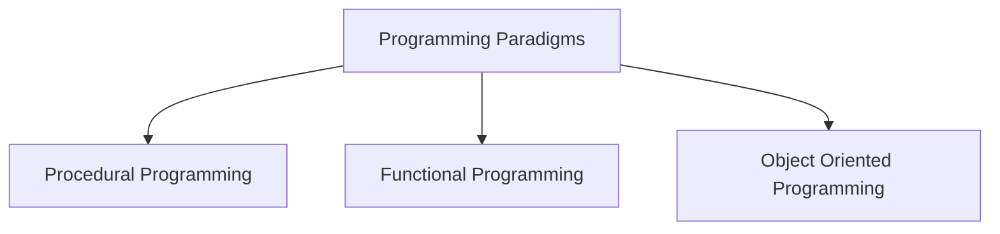
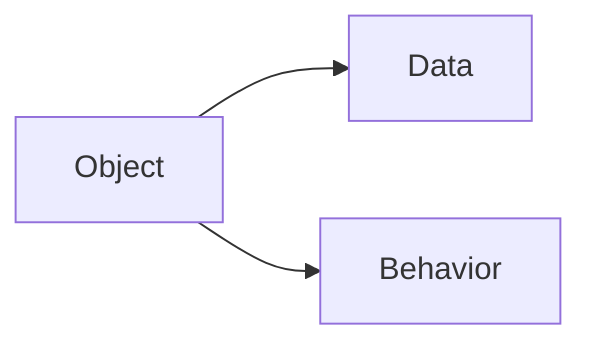
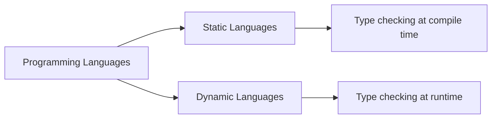
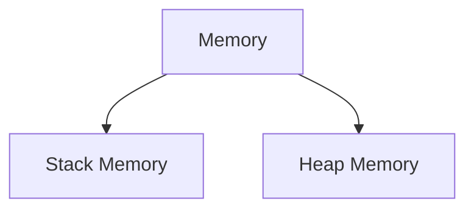
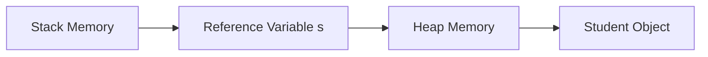
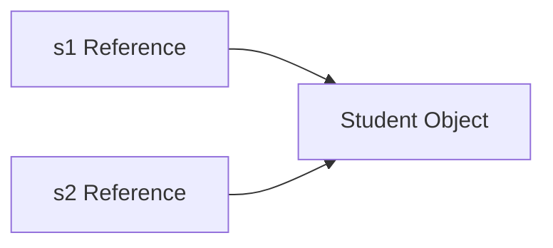
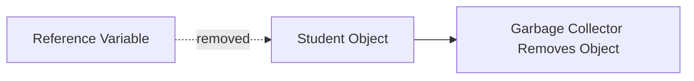

# Introduction to Programming

## What is Programming?

Programming is the process of **instructing a computer to perform tasks**.

Computers understand only **binary language**.

```
Binary → 0 and 1
```

Writing instructions directly in binary is difficult for humans, therefore **programming languages** are used.

---

# Programming Language

A **programming language** is used by programmers to communicate with computers.

Examples:

- Java
    
- Python
    
- C++
    
- JavaScript
    

These languages are translated into **machine instructions** that the computer understands.

---

# Types of Programming Paradigms

Programming languages follow different paradigms.



---

# Procedural Programming

Procedural programming executes instructions **step-by-step**.

### Characteristics

- Program organized as procedures/functions
    
- Sequential execution of instructions
    
- Focus on algorithm steps
    

### Example

```java
public class Example {

    static void display(){
        System.out.println("Hello World");
    }

    public static void main(String[] args){
        display();
    }

}
```

---

# Functional Programming

Functional programming focuses on **pure functions**.

### Characteristics

- Avoids modifying variables
    
- Produces new values instead of changing existing ones
    
- Emphasizes immutability
    

### Example (Java Stream)

```java
List<Integer> numbers = List.of(1,2,3);

numbers.stream()
       .map(n -> n * 2)
       .forEach(System.out::println);
```

---

# Object-Oriented Programming

Object-oriented programming is based on **objects**.



Example:

```java
class Student {

    int id;
    String name;

    void study(){
        System.out.println("Studying");
    }

}
```

Advantages:

- Code reusability
    
- Easier debugging
    
- Easier maintenance
    

---

# Static vs Dynamic Languages



### Static Language Example

```java
int a = 10;
```

### Dynamic Language Example

```python
a = 10
```

---

# Memory Management

Memory in programming is mainly divided into two parts.



---

# Stack Memory

Stack memory stores:

- Method calls
    
- Local variables
    
- Reference variables
    

Characteristics:

- Fast access
    
- Automatically managed
    
- Uses **LIFO (Last In First Out)**
    

---

# Heap Memory

Heap memory stores:

- Objects
    
- Arrays
    
- Class instances
    

Example:

```java
Student s = new Student();
```

---

# Stack vs Heap Visualization



This shows that **reference variables are stored in stack**, while **objects are stored in heap**.

---

# Reference Variables

Reference variables store the **memory address of objects**.

Example:

```java
Student s1 = new Student();
Student s2 = s1;
```

Visualization:



Both variables refer to the **same object in heap memory**.

---

# Garbage Collection

If an object has **no reference variable**, it becomes eligible for **Garbage Collection**.

Example:

```java
Student s = new Student();
s = null;
```

Visualization:



---

