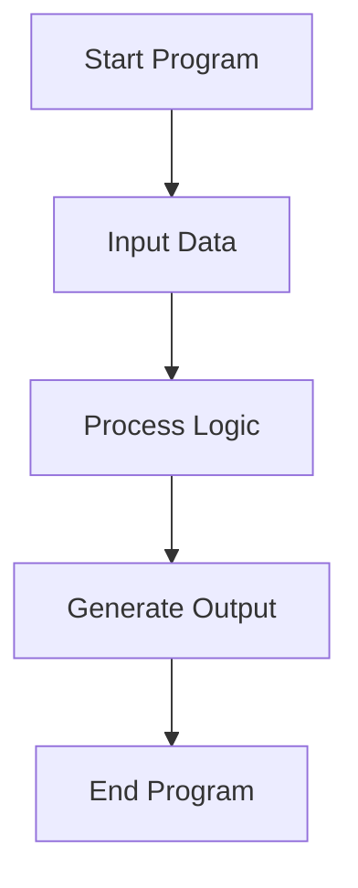
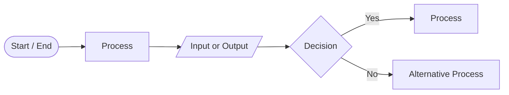
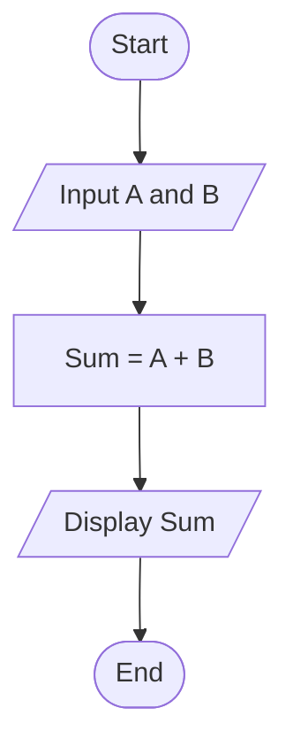
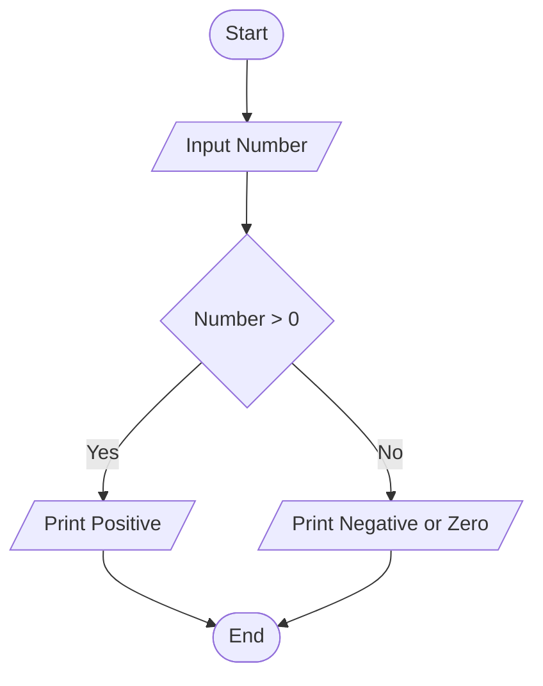
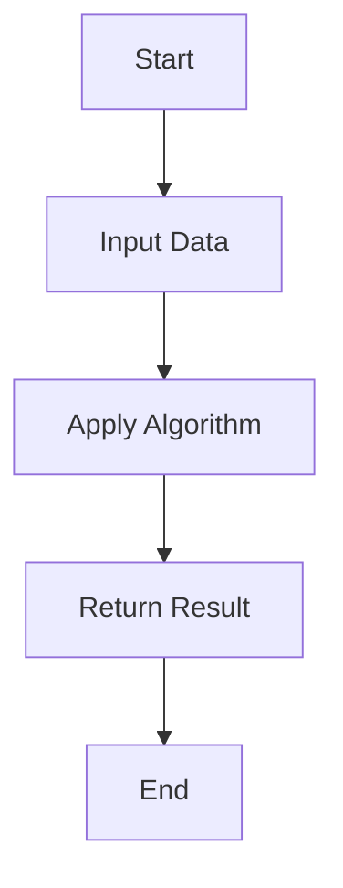

# Flow of Program

## Overview

The **flow of a program** describes how a program executes instructions step-by-step from start to end.

Every program follows a logical sequence:

```
Start → Input → Processing → Output → End
```

Understanding program flow helps us:

- design algorithms
    
- visualize logic
    
- debug programs
    
- simplify complex problems
    

---

# Program Execution Flow

A program executes instructions sequentially unless control statements change the flow.



Example:

```java
public class Example {

    public static void main(String[] args) {

        int a = 10;
        int b = 20;

        int sum = a + b;

        System.out.println(sum);

    }

}
```

Execution flow:

1. Program starts
    
2. Variables created
    
3. Calculation performed
    
4. Result printed
    
5. Program ends
    

---

# Flowchart

A **flowchart** is a graphical representation of program logic.

It helps visualize the flow of instructions before writing code.

Benefits:

- easier to understand logic
    
- simplifies algorithm design
    
- helps detect errors early
    

---

# Common Flowchart Symbols



Meaning of symbols:

|Symbol|Meaning|
|---|---|
|Oval|Start / End|
|Rectangle|Process|
|Parallelogram|Input / Output|
|Diamond|Decision|

---

# Example Flowchart

Example problem:

**Find the sum of two numbers**



Equivalent Java code:

```java
import java.util.Scanner;

public class SumExample {

    public static void main(String[] args) {

        Scanner sc = new Scanner(System.in);

        int a = sc.nextInt();
        int b = sc.nextInt();

        int sum = a + b;

        System.out.println(sum);
    }
}
```

---

# Decision Flow

Programs often need **decision making**.

Example:

Check if a number is positive.



Equivalent Java code:

```java
int number = 10;

if(number > 0){
    System.out.println("Positive");
}else{
    System.out.println("Negative or Zero");
}
```

---

# Pseudocode

**Pseudocode** is a simple way of writing program logic using plain language.

It is not tied to any programming language.

Example:

```
START

INPUT A
INPUT B

SUM = A + B

PRINT SUM

END
```

Advantages:

- easy to understand
    
- language independent
    
- helps convert logic into code easily
    

---

# Flowchart vs Pseudocode

|Flowchart|Pseudocode|
|---|---|
|Visual representation|Text representation|
|Uses diagrams|Uses structured statements|
|Easy for visualization|Easy to convert to code|

---

# Why Program Flow Is Important for DSA

Understanding program flow helps when learning:

- conditional statements
    
- loops
    
- recursion
    
- algorithms
    

Most algorithms follow this pattern:



---
