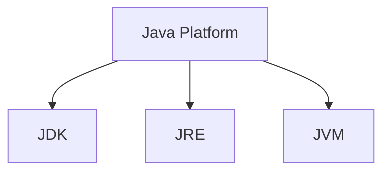
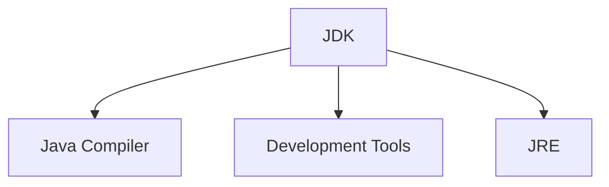
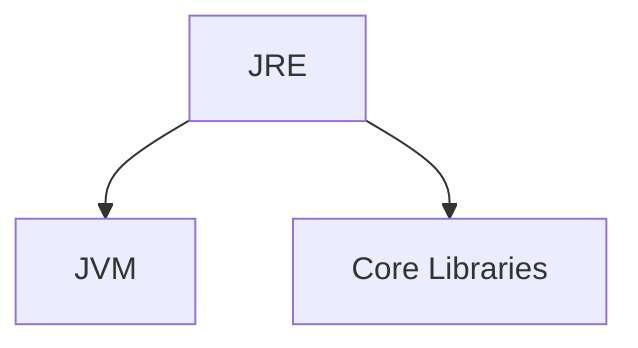
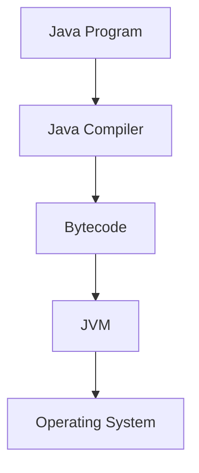
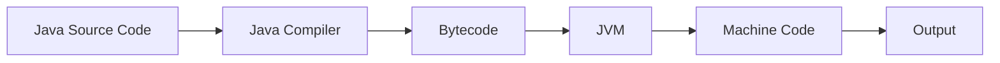
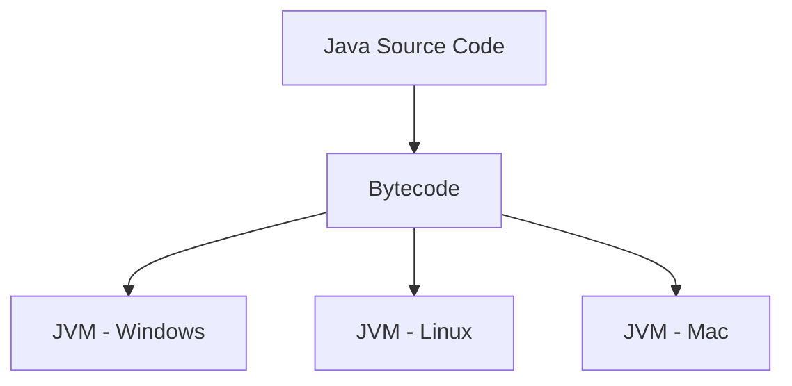
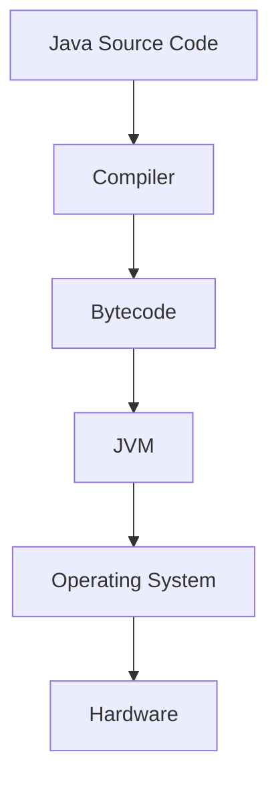

# Introduction to Java – Architecture & Installation

## Overview

Java is a **high-level, object-oriented programming language** designed to be:

- platform independent
    
- secure
    
- portable
    
- robust
    

One of the main reasons Java became popular is the concept:

```
Write Once, Run Anywhere
```

Java programs can run on **any system that has a Java Virtual Machine (JVM)**.

---

# Java Platform

Java is not just a programming language. It is a **complete platform**.

A Java platform includes:

- Java Development Kit (JDK)
    
- Java Runtime Environment (JRE)
    
- Java Virtual Machine (JVM)
    



---

# Java Development Kit (JDK)

JDK is the **complete development environment** used for creating Java applications.

It contains:

- compiler
    
- debugger
    
- development tools
    
- runtime environment
    



Example tools inside JDK:

|Tool|Purpose|
|---|---|
|javac|Compiles Java code|
|java|Runs Java program|
|javadoc|Generates documentation|

---

# Java Runtime Environment (JRE)

JRE provides the **runtime environment** required to execute Java programs.

It contains:

- JVM
    
- Java libraries
    
- supporting files
    



---

# Java Virtual Machine (JVM)

JVM is responsible for **executing Java bytecode**.

It acts as a **bridge between Java program and operating system**.



---

# Java Execution Flow

When a Java program runs, it follows this process:



Step-by-step process:

1. Write Java source code
    
2. Compile using **javac**
    
3. Compiler generates **bytecode**
    
4. Bytecode runs on **JVM**
    
5. JVM converts bytecode to **machine instructions**
    

---

# Write Once Run Anywhere (WORA)

Java achieves platform independence using **bytecode and JVM**.



The same bytecode runs on different operating systems because **each OS has its own JVM implementation**.

---

# Java Architecture

Java architecture ensures **platform independence and security**.



---

# Installing Java

To start programming in Java, you need to install **JDK**.

Steps:

### 1 Download JDK

Download from the official website:

```
https://www.oracle.com/java/technologies/downloads/
```

You can also install **OpenJDK**.

---

### 2 Install JDK

Run the installer and complete the installation.

---

### 3 Verify Installation

Open terminal or command prompt and run:

```bash
java -version
```

Example output:

```
java version "17"
```

Check compiler:

```bash
javac -version
```

---

# First Java Program

Create a file:

```
HelloWorld.java
```

Example code:

```java
public class HelloWorld {

    public static void main(String[] args) {

        System.out.println("Hello World");

    }

}
```

---

# Compile the Program

Compile using:

```bash
javac HelloWorld.java
```

This generates:

```
HelloWorld.class
```

The `.class` file contains **bytecode**.

---
