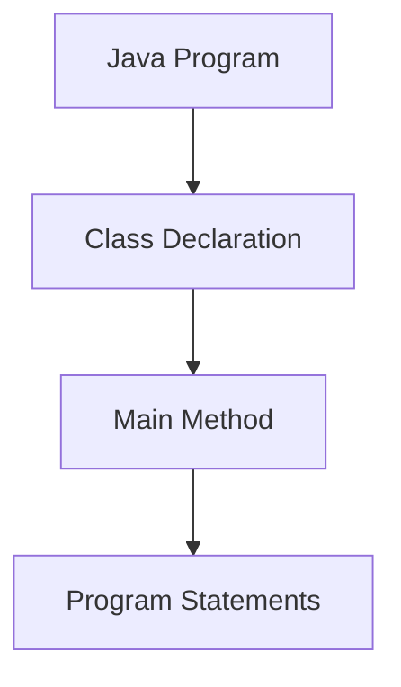
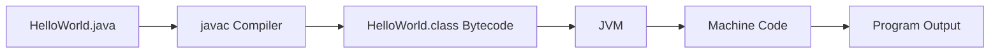
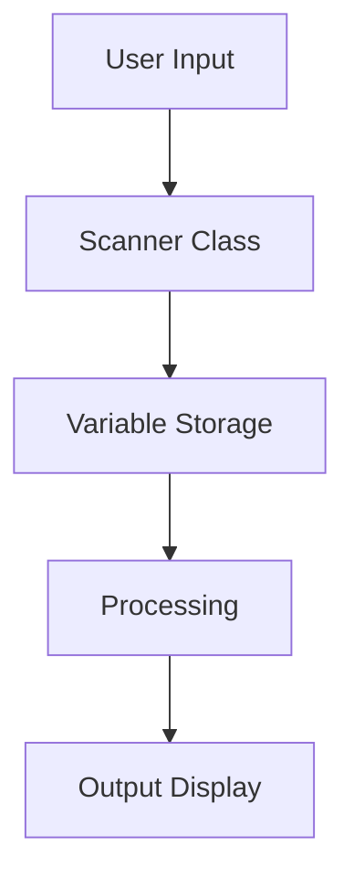
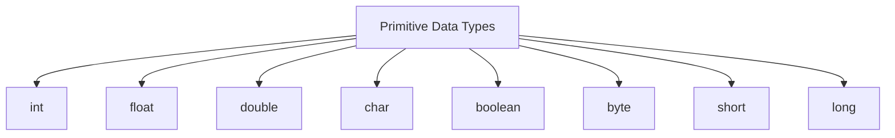
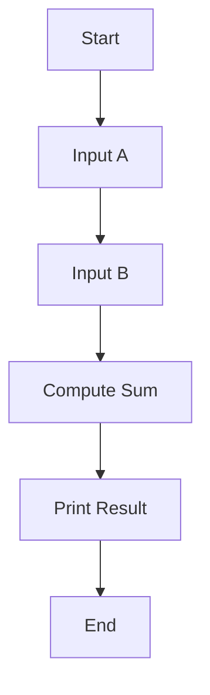

## Overview

This lecture introduces the basics of writing and running a Java program.  
Topics covered include:

- Writing the first Java program
    
- Input and Output in Java
    
- Java data types
    
- Debugging basics
    
- Program execution flow
    

The goal is to understand how a **Java program is written, compiled, and executed**.

---

# Structure of a Java Program

A Java program is composed of the following components:

- Class declaration
    
- Main method
    
- Statements (instructions)
    



---

# First Java Program (Hello World)

```java
public class HelloWorld {

    public static void main(String[] args) {
        System.out.println("Hello World");
    }

}
```

---

# Explanation of the Code

|Component|Meaning|
|---|---|
|`public`|Access modifier|
|`class`|Defines a class|
|`HelloWorld`|Class name|
|`main()`|Entry point of Java program|
|`System.out.println()`|Prints output to console|

---

# Java Program Execution Process

Java programs follow a specific execution pipeline.



Steps:

1. Write source code in `.java` file
    
2. Compile using `javac`
    
3. Bytecode `.class` file is generated
    
4. JVM executes bytecode
    
5. Output is produced
    

---

# Input and Output in Java

Programs often need user input and produce output.

## Output

Output is displayed using:

```java
System.out.println("Hello World");
```

Example:

```java
System.out.println("Welcome to Java");
```

Output:

```
Welcome to Java
```

---

# Taking Input in Java

Java uses the **Scanner class** to read user input.

Example:

```java
import java.util.Scanner;

public class InputExample {

    public static void main(String[] args) {

        Scanner input = new Scanner(System.in);

        int number = input.nextInt();

        System.out.println("Number is: " + number);

    }
}
```

---

# Input Processing Flow



---

# Java Data Types

Java supports several **primitive data types**.



Example:

```java
int age = 25;
float price = 10.5f;
char grade = 'A';
boolean isActive = true;
```

---

# Variables

A variable stores a value in memory.

Syntax:

```
datatype variableName = value;
```

Example:

```java
int number = 10;
```

---

# Debugging

Debugging means **finding and fixing errors in a program**.

Types of errors:

---

## Syntax Error

Occurs when code violates Java syntax rules.

Example:

```java
System.out.println("Hello World"
```

Missing `;`

---

## Runtime Error

Occurs during program execution.

Example:

```
Divide by zero
```

---

## Logical Error

Program runs successfully but produces wrong output.

Example:

```java
int result = a - b; // incorrect logic
```

---

# Complete Program Example

```java
import java.util.Scanner;

public class SumProgram {

    public static void main(String[] args) {

        Scanner input = new Scanner(System.in);

        System.out.print("Enter first number: ");
        int a = input.nextInt();

        System.out.print("Enter second number: ");
        int b = input.nextInt();

        int sum = a + b;

        System.out.println("Sum = " + sum);

    }
}
```

---

# Program Flow Example



---

# Practice Problems (From Lecture Notes)

Try implementing these programs:

1. Check if a number is even or odd
    
2. Print greeting message using input name
    
3. Calculate simple interest (P × T × R)
    
4. Calculator using two numbers and operator
    
5. Find largest of two numbers
    
6. Convert rupees to USD
    
7. Fibonacci series
    
8. Check palindrome string
    
9. Armstrong number between two numbers
    

These exercises help build **basic programming logic**.

---
